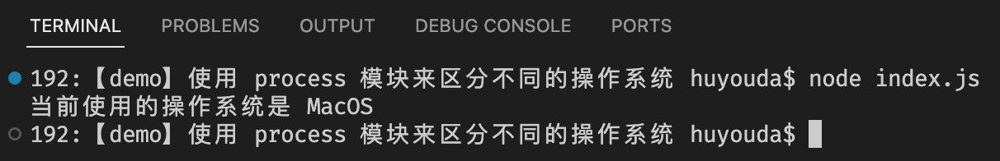

# 0001. 使用 process 模块来区分不同的操作系统

很简单也很常用的操作 - 通过 process.platform 中记录的当前平台信息来区分不同的操作系统。

```js
function printPlatform() {
  if (process.platform === 'linux') console.log('当前使用的操作系统是 Linux')
  else if (process.platform === 'darwin') console.log('当前使用的操作系统是 MacOS')
  else if (process.platform === 'win32') console.log('当前使用的操作系统是 Windows')
  else console.log('当前使用的操作系统是未知')
}

printPlatform()
```

