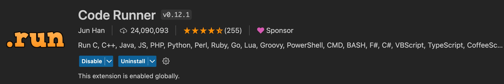
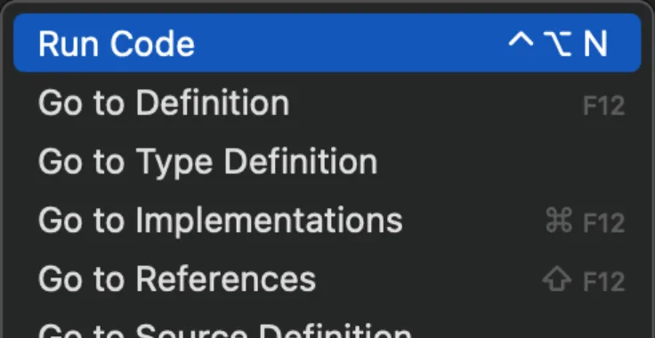

# [0004. 学会使用 nodejs 运行 .js 文件](https://github.com/Tdahuyou/nodejs/tree/main/0004.%20%E5%AD%A6%E4%BC%9A%E4%BD%BF%E7%94%A8%20nodejs%20%E8%BF%90%E8%A1%8C%20.js%20%E6%96%87%E4%BB%B6)


<!-- region:toc -->
- [1. 📝 summary](#1--summary)
- [2. 🔗 links](#2--links)
- [3. 📒 notes](#3--notes)
- [4. 📒 使用 nodejs 运行 .js 文件](#4--使用-nodejs-运行-js-文件)
- [5. 📒 code runner 插件](#5--code-runner-插件)
- [6. 📒 使用 code runner 插件运行 .js 文件](#6--使用-code-runner-插件运行-js-文件)
- [7. 📒 code runner 插件原理](#7--code-runner-插件原理)
- [8. 📒 code runner 支持哪些语言？](#8--code-runner-支持哪些语言)
<!-- endregion:toc -->

## 1. 📝 summary

- 视频：✅

## 2. 🔗 links

- https://marketplace.visualstudio.com/items?itemName=formulahendry.code-runner - vscode marketplace - code runner 插件。

## 3. 📒 notes

- 使用 nodejs 运行 .js 脚本非常简单，只需要执行 `node xxx.js` 即可。

本文介绍了两种（使用终端手输 node 命令/使用插件自动生成运行命令）使用 nodejs 运行 .js 文件的方式。

## 4. 📒 使用 nodejs 运行 .js 文件

**使用 node 命令来运行 .js 文件**

准备一个 index.js 文件，内容如下。

```js
console.log('hello world!')
```

> 在文件所在位置打开终端，输入命令 node index.js 运行 index.js 文件。

```bash
# 确保 nodejs 已经成功安装
$ node -v
# v20.10.0
# 成功输出一个版本号，表示 nodejs 已成功安装


# 运行 index.js 文件
$ node index.js
# hello world!
# 如果成功打印出内容，表示成功运行了 index.js 文件
```

## 5. 📒 code runner 插件



对于 code runner，我们只需要知道如何使用 code runner 插件来运行脚本即可，如果想要略过打开终端输入命令这种方式来执行脚本的话，可以考虑下 code runner 这玩意儿。

## 6. 📒 使用 code runner 插件运行 .js 文件

插件成功安装后，找到想要运行的文件，然后右键，选择 Run Code 即可。这样就不需要再打开终端去手输 node 命令了，很方便。



## 7. 📒 code runner 插件原理

code runner 运行 .js 文件的本质也是使用 node 命令去跑，和我们纯手输 node index.js 其实都是一样的。

## 8. 📒 code runner 支持哪些语言？

其实，除了 js 之外，还有很多脚本都可以用它来快速跑。比如 Python、TypeScript 等，你可以在 code runner 插件介绍中看到它都支持那些语言。
> Run code snippet or code file for multiple languages: C, C++, Java, JavaScript, PHP, Python, Perl, Perl 6, Ruby, Go, Lua, Groovy, PowerShell, BAT/CMD, BASH/SH, F# Script, F# (.NET Core), C# Script, C# (.NET Core), VBScript, TypeScript, CoffeeScript, Scala, Swift, Julia, Crystal, OCaml Script, R, AppleScript, Elixir, Visual Basic .NET, Clojure, Haxe, Objective-C, Rust, Racket, Scheme, AutoHotkey, AutoIt, Kotlin, Dart, Free Pascal, Haskell, Nim, D, Lisp, Kit, V, SCSS, Sass, CUDA, Less, Fortran, Ring, Standard ML, Zig, Mojo, Erlang, SPWN, Pkl, Gleam, and custom command