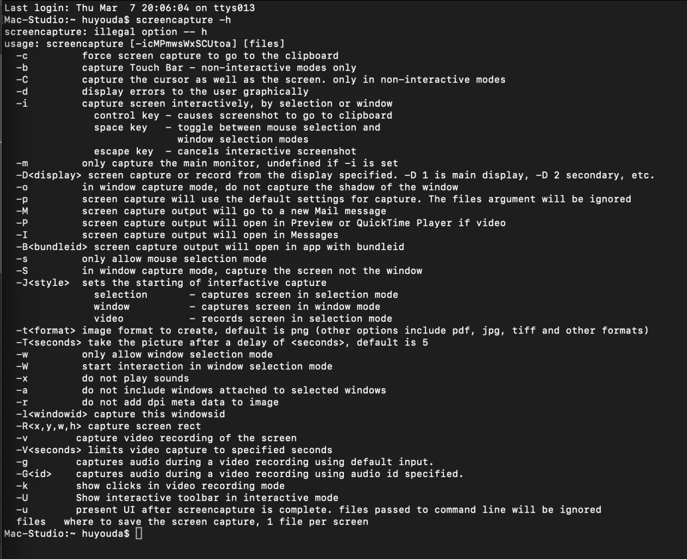

# [0006. 使用 screencapture 命令实现 macos 系统截图](https://github.com/Tdahuyou/nodejs/tree/main/0006.%20%E4%BD%BF%E7%94%A8%20screencapture%20%E5%91%BD%E4%BB%A4%E5%AE%9E%E7%8E%B0%20macos%20%E7%B3%BB%E7%BB%9F%E6%88%AA%E5%9B%BE)


<!-- region:toc -->
- [1. 📝 summary](#1--summary)
- [2. 🔗 links](#2--links)
- [3. 💻 demo1](#3--demo1)
<!-- endregion:toc -->

## 1. 📝 summary


本文介绍如何在 macOS 上使用 screencapture 命令来实现截图功能。

## 2. 🔗 links

- https://support.apple.com/zh-cn/guide/mac-help/mh26782/mac - Apple，macOS 使用手册。查看【 macOS 使用手册】了解有关【在 Mac 上截屏或录屏】的相关内容。

## 3. 💻 demo1

```js
// index.js
const { exec } = require('child_process')
const path = require('path')

/** 获取当前时间并格式化为 yyyy-mm-dd-hh-mm-ss */
function getFormattedTime() {
  const now = new Date()
  const year = now.getFullYear().toString()
  const month = (now.getMonth() + 1).toString().padStart(2, '0')
  const day = now.getDate().toString().padStart(2, '0')
  const hour = now.getHours().toString().padStart(2, '0')
  const minute = now.getMinutes().toString().padStart(2, '0')
  const second = now.getSeconds().toString().padStart(2, '0')
  return `${year}-${month}-${day}-${hour}-${minute}-${second}`
}

const screenshotPath = path.join(__dirname, `${getFormattedTime()}.jpg`)

const command = `screencapture -x -i "${screenshotPath}"`

exec(command, (error) => {
  if (error) {
    console.error(`执行出错: ${error}`)
    return
  }
  console.log(`屏幕截图已保存至: ${screenshotPath}`)
})
```

```js
const command = `screencapture -x -i "${screenshotPath}"`
```

**参数说明**
- `-x` 表示关闭截图声音。
- `-i` 表示进行交互式捕获，也就是允许你选择捕获的区域。
- `"${screenshotPath}"` 这一部分表示截图需要保存的位置。
- …… 其它配置项见 `screencapture -h` 日志

**查看 screencapture 的帮助信息**

```bash
$ screencapture -h
# screencapture: illegal option -- h
# usage: screencapture [-icMPmwsWxSCUtoa] [files]
#   -c         force screen capture to go to the clipboard
#   -b         capture Touch Bar - non-interactive modes only
#   -C         capture the cursor as well as the screen. only in non-interactive modes
#   -d         display errors to the user graphically
#   -i         capture screen interactively, by selection or window
#                control key - causes screenshot to go to clipboard
#                space key   - toggle between mouse selection and
#                              window selection modes
#                escape key  - cancels interactive screenshot
#   -m         only capture the main monitor, undefined if -i is set
#   -D<display> screen capture or record from the display specified. -D 1 is main display, -D 2 secondary, etc.
#   -o         in window capture mode, do not capture the shadow of the window
#   -p         screen capture will use the default settings for capture. The files argument will be ignored
#   -M         screen capture output will go to a new Mail message
#   -P         screen capture output will open in Preview or QuickTime Player if video
#   -I         screen capture output will open in Messages
#   -B<bundleid> screen capture output will open in app with bundleid
#   -s         only allow mouse selection mode
#   -S         in window capture mode, capture the screen not the window
#   -J<style>  sets the starting of interfactive capture
#                selection       - captures screen in selection mode
#                window          - captures screen in window mode
#                video           - records screen in selection mode
#   -t<format> image format to create, default is png (other options include pdf, jpg, tiff and other formats)
#   -T<seconds> take the picture after a delay of <seconds>, default is 5
#   -w         only allow window selection mode
#   -W         start interaction in window selection mode
#   -x         do not play sounds
#   -a         do not include windows attached to selected windows
#   -r         do not add dpi meta data to image
#   -l<windowid> capture this windowsid
#   -R<x,y,w,h> capture screen rect
#   -v        capture video recording of the screen
#   -V<seconds> limits video capture to specified seconds
#   -g        captures audio during a video recording using default input.
#   -G<id>    captures audio during a video recording using audio id specified.
#   -k        show clicks in video recording mode
#   -U        Show interactive toolbar in interactive mode
#   -u        present UI after screencapture is complete. files passed to command line will be ignored
#   files   where to save the screen capture, 1 file per screen
```

**最终效果**


其中，`2024-03-07-20-39-32.jpg` 就是该程序截取的图片。

