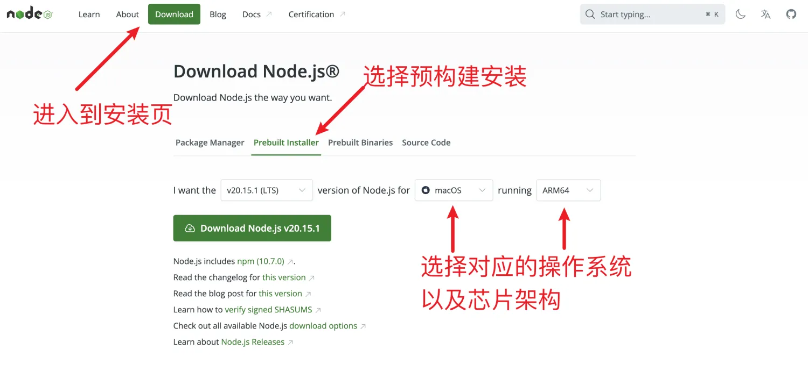
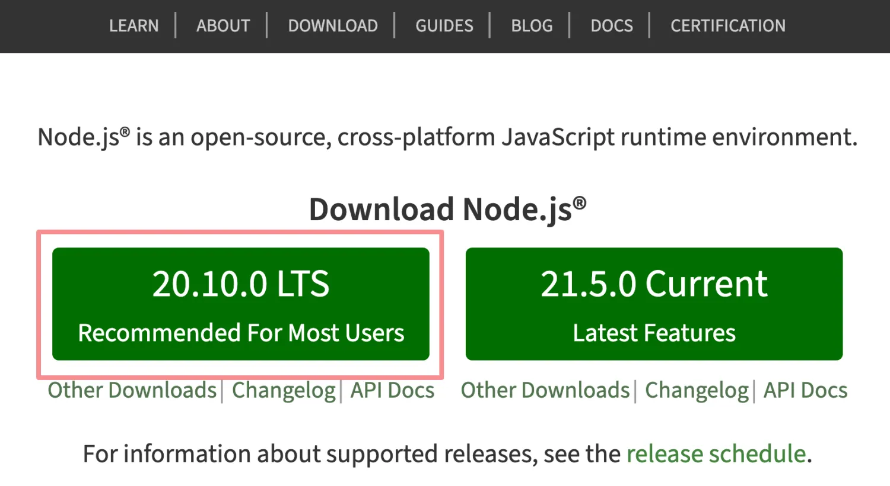

# [0013. 安装 nodejs](https://github.com/Tdahuyou/nodejs/tree/main/0013.%20%E5%AE%89%E8%A3%85%20nodejs)

<!-- region:toc -->
- [1. 📝 summary](#1--summary)
- [2. 🔗 links](#2--links)
- [3. 📒 notes - 新版 nodejs](#3--notes---新版-nodejs)
- [4. 📒 notes - 旧版 nodejs](#4--notes---旧版-nodejs)
<!-- endregion:toc -->

## 1. 📝 summary

- 视频：✅

## 2. 🔗 links

- https://nodejs.org/en - nodejs 官网文档。

## 3. 📒 notes - 新版 nodejs



视频中演示的是旧版安装 nodejs 的步骤。最新版的 nodejs 的页面发生了一些变化，你可以在这里找到跟视频中一致的安装程序，然后无脑下一步（也可以跟着视频中演示的步骤）完成安装即可。

**查看 node 版本 - 验证 nodejs 是否成功安装**

无论是从旧版的页面还是新版的页面下载的 nodejs，最终验证安装成功的命令（查看 node 版本的命令）都是一致的 `node -v`。

```bash
$ node -v
# v20.10.0
```

## 4. 📒 notes - 旧版 nodejs

**安装 nodejs**



建议下载左侧的稳定版，全程点击下一步，即可完成安装。