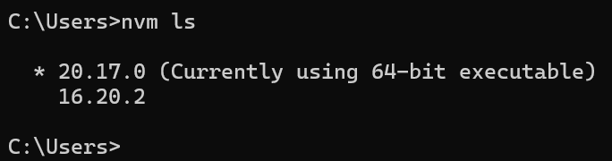
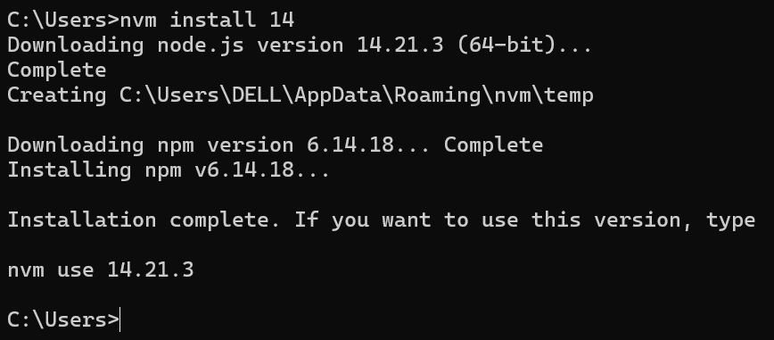
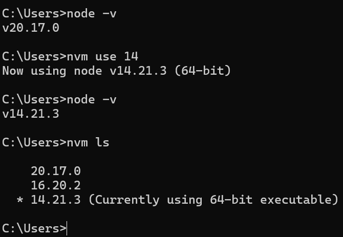

# [0014. 如何使用 nvm 管理 nodejs 版本](https://github.com/Tdahuyou/nodejs/tree/main/0014.%20%E5%A6%82%E4%BD%95%E4%BD%BF%E7%94%A8%20nvm%20%E7%AE%A1%E7%90%86%20nodejs%20%E7%89%88%E6%9C%AC)


<!-- region:toc -->
- [1. 📝 summary](#1--summary)
- [2. 🔗 links](#2--links)
- [3. 📒 notes](#3--notes)
- [4. 💻 demo - `nvm ls` 查看本地安装的所有 nodejs 版本](#4--demo---nvm-ls-查看本地安装的所有-nodejs-版本)
- [5. 💻 demo - `nvm install <version>` 安装指定版本的 nodejs](#5--demo---nvm-install-<version>-安装指定版本的-nodejs)
- [6. `nvm use <version>` 使用指定版本的 nodejs](#6-nvm-use-<version>-使用指定版本的-nodejs)
- [7. 🤖 如何下载 nvm 管理 nodejs 版本](#7--如何下载-nvm-管理-nodejs-版本)
  - [7.1. 安装 NVM](#71-安装-nvm)
  - [7.2. 设置 NVM](#72-设置-nvm)
  - [7.3. 使用 NVM 安装 Node.js](#73-使用-nvm-安装-nodejs)
<!-- endregion:toc -->

## 1. 📝 summary


- 以下是 nvm 的一些常用命令
  - `nvm ls` 查看本地安装的所有 nodejs 版本。
  - `nvm install <version>` 安装指定版本的 nodejs。
  - `nvm use <version>` 使用指定版本的 nodejs。
- nodejs 查看当前版本
  - `node -v`
  - 也可以通过 `nvm ls` 来查看，前面带有星号 * 的版本为当前使用的版本。
- 官方文档的 README.md 内容很全，详细介绍可以参考官方文档。

## 2. 🔗 links

- https://github.com/nvm-sh/nvm
  - github nvm

## 3. 📒 notes

## 4. 💻 demo - `nvm ls` 查看本地安装的所有 nodejs 版本

```bash
nvm ls
```



## 5. 💻 demo - `nvm install <version>` 安装指定版本的 nodejs

```bash
nvm install 14
```



## 6. `nvm use <version>` 使用指定版本的 nodejs

```bash
node -v
nvm use 14
node -v
```




## 7. 🤖 如何下载 nvm 管理 nodejs 版本


要使用 NVM（Node Version Manager）来管理 Node.js 的不同版本，首先你需要安装 NVM。以下是安装 NVM 并使用它来管理 Node.js 版本的步骤：

### 7.1. 安装 NVM

1. **对于 macOS 和 Linux 用户**:

打开终端并运行以下命令来安装 NVM：

```sh
curl -o- https://raw.githubusercontent.com/nvm-sh/nvm/v0.39.1/install.sh | bash
```
或者
```sh
wget -qO- https://raw.githubusercontent.com/nvm-sh/nvm/v0.39.1/install.sh | bash
```

请将 `v0.39.1` 替换为最新的版本号。你可以访问 [NVM GitHub 仓库](https://github.com/nvm-sh/nvm) 查看最新版本。

2. **对于 Windows 用户**:

Windows 用户可以使用 Chocolatey, Scoop 或者直接从 [NVM for Windows](https://github.com/coreybutler/nvm-windows) 下载安装包进行安装。

### 7.2. 设置 NVM

- 在安装完成后，关闭并重新打开终端（或在当前终端中运行 `source ~/.bashrc` 或 `source ~/.zshrc` 如果你使用的是 ZSH shell），使更改生效。

### 7.3. 使用 NVM 安装 Node.js

1. 列出所有可安装的 Node.js 版本：
```sh
nvm ls-remote
```

2. 安装特定版本的 Node.js：
```sh
nvm install <version>
```
例如，要安装最新的稳定版，你可以运行：
```sh
nvm install --lts
```

3. 切换到已安装的 Node.js 版本：
```sh
nvm use <version>
```

4. 检查当前正在使用的 Node.js 版本：
```sh
node -v
```

通过上述步骤，你应该能够成功安装和使用 NVM 来管理 Node.js 的多个版本了。如果你遇到任何问题，请检查 NVM 的官方文档以获取更多帮助。
