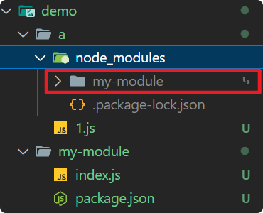
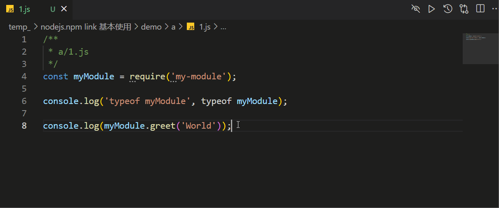

# [0024. npm link 基本使用](https://github.com/Tdahuyou/nodejs/tree/main/0024.%20npm%20link%20%E5%9F%BA%E6%9C%AC%E4%BD%BF%E7%94%A8)

- 本节介绍了 `npm link` 的基本使用。
- 重点在于理解 `npm link` 的应用场景，主要用于解决什么问题。

## 🔗 links

- https://docs.npmjs.com/cli/v10/commands/npm-link
  - npm docs - npm-link

## 📒 notes - `npm link` 简介

- `npm link` 用于在开发过程中链接本地模块。
- `npm link` 使得你可以在一个项目中测试另一个项目的更改，而不需要每次都重新发布和安装。

## 💻 demo - `npm link` 基本使用

- 目录结构：

```shell
demo
├── a # 假设这是我们正在开发的某个项目
│   ├── 1.js
└── my-module # 假设这是我们项目依赖的一个本地模块
    ├── index.js
    └── package.json
```

- 文件内容如下：

```js
/**
 * a/1.js
 */
const myModule = require('my-module');

console.log('typeof myModule', typeof myModule);

console.log(myModule.greet('World'));
```

```js
/**
 * my-module/index.js
 */
module.exports = {
    greet: function (name) {
        return 'Hello, ' + name;
    },
};
```

- `my-module/package.json` 内容如下：

```json
{
  "name": "my-module",
  "version": "1.0.0",
  "main": "index.js"
}
```

- 在 my-module 中创建符号链接
  - 切换到 my-module 目录所在位置，执行 `npm link`。
- 在 a 中引用 my-module
  - 切换到 a 目录所在位置，执行 `npm link my-module`。
- 最终效果：
  - 
  - 如果看到 node_modules/my-module 结尾有一个小箭头，这就意味着链接已经创建了。
- 验证符号链接是否已经创建：
  - 按下 ctrl 并点击 my-module，快速跳转到 my-module 所在位置，会发现打开的是 `demo/my-module/index.js` 而非 `demo/a/node_modules/my-module/index.js`，这就意味着软链接已经生效了。
  - 
  - 可以尝试先运行 1.js 看看打印结果，然后修改 `demo/my-module/index.js` 中的内容，比如在结尾加上一条打印语句 `console.log(123)` 然后再运行 1.js 看看打印结果，如果 `123` 输出了，这就意味着符号链接已经生效了。

## 📒 notes - 和 link 相关的命令

- `npm link` - 创建符号链接
  - 假设你有一个本地模块 `my-module`，并且你想在一个项目 `my-project` 中使用它。
  - 在 `my-module` 目录中创建全局链接
  - 首先，导航到 `my-module` 的根目录，然后运行：`npm link` 这会在全局 `npm` 路径中创建一个符号链接，指向 `my-module` 的当前工作目录。
- `npm link my-module` - 引用软链接 `my-module`
  - 接下来，导航到 `my-project` 的根目录，然后运行：`npm link my-module`。这会在 `my-project` 的 `node_modules` 目录中创建一个符号链接，指向全局 `npm` 路径中的 `my-module`。
- `npm unlink my-module` - 卸载链接
  - 当你不再需要链接时，可以卸载链接。导航到 `my-project` 的根目录，然后运行：`npm unlink my-module`。这会删除 `my-project` 的 `node_modules` 目录中的符号链接。
- `npm unlink` 或者 `npm unlink -g my-module` - 删除全局 `npm` 路径中的符号链接
  - 导航到 `my-module` 的根目录，然后运行：`npm unlink`。这会删除全局 `npm` 路径中的符号链接。
- `npm ls --global --depth=0` - 查看全局安装的包
  - 使用 `npm ls --global` 这个命令会列出所有全局安装的包及其依赖关系，包括任何通过 `npm link` 创建的软链接。
  - 使用 `--depth=0` 参数来限制依赖树的深度，这将只显示顶级全局安装的包，而不显示它们的依赖关系。
    - 多提一嘴，当你执行 `npm ls --global` 的时候，`--depth` 参数的默认值就是 `0`，因此写或者不写 `--depth=0` 都是一样的。

```bash
$ npm ls --global
# C:\Users\Tdahuyou\AppData\Roaming\npm
# +-- my-module@1.0.0 -> .\..\..\..\Desktop\notes\temp_\nodejs.npm link 基本使用\demo\my-module
# +-- ...
# +-- ...
# +-- ...

# 当你创建好符号链接之后，可以通过 npm ls --global 来打印所有的全局依赖包，包括你创建的符号链接。
# 如果在输出结果中看到了你创建的符号链接，说明你已经成功创建了符号链接，这也算是一种验证符号链接是否创建成功的方式。
```

- **补充说明**
  - **重新链接** - 如果你对 `my-module` 进行了更改并希望在 `my-project` 中测试这些更改，只需重新运行上述步骤即可。
  - **路径问题** - 确保你在正确的目录中运行 `npm link` 和 `npm unlink` 命令。
  - **全局路径** - `npm link` 创建的全局链接默认位于 `npm` 的全局安装目录中，可以通过 `npm config get prefix` 查看该目录。

## 📒 notes - `npm link` 的实际应用场景

1. 场景1：你是 vue、react 的开发者，你正在写一个新的功能或者修改某个 bug，当你写完之后，你需要在本地的一个项目 A 中测试新 vue、react 的功能是否正常，或者 bug 是否已经修复。
   1. 方式1：不使用 npm link
      1. 【发布】这时候你需要将本次修改提交到远程仓库，完成发布，比如 `npm publish`。
      2. 【安装】然后在某个测试的项目 A 里安装依赖，比如 `npm install xxx`。
      3. 【测试】然后再测试，如果发现问题，你还需要重复上述流程，直到问题解决。
   2. 方式2：使用 npm link
      1. 【创建软链接】切换到 vue、react 所在位置，执行 `npm link` 创建一个软链接。
      2. 【引用软链接】切换到某个测试的项目 A 中，执行 `npm link xxx` 引用软链接。
      3. 【测试】在 A 中测试的时候，修改 vue、react 的代码，然后保存，此时 vue、react 中修改的内容在 A 中就会自动更新。
2. 场景2：你正在开发项目 A，这个项目 A 中依赖了某个开源的第三方库 B，但是 B 中的一些功能并不符合你的预期，而且你又找不到更好的库来替换 B 了，这时候你考虑修改 B 中的代码来解决问题。
   1. 修改流程：
      1. git clone B 到本地，然后修改 B 的代码。
      2. 然后在本地创建 B 的软链接 - 切换到 B 所在的目录，执行 npm link 命令。
      3. 然后切换到项目 A 中，执行 npm link B，此时项目 A 中就会引用你修改后的 B。
      4. 注意：当你修改完 B 的源码后，往往还需要执行一下 B 的打包命令，出个包，因为 A 中引入的往往是 B 的打包产物。
      5. 注意：A 在打包的时候会根据软链接找到 B，因此不需要担心这个问题 —— B 不在 A 的 node_modules 中，A 打包的时候会不会找不到 B。
   2. 错误的修改流程：直接到 node_modules 中找到 B 然后直接修改。