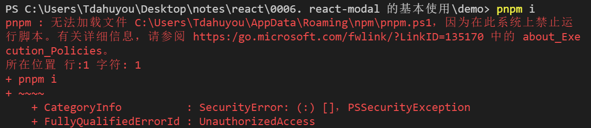

# [0027. 在 Windows 的 power shell 中执行 pnpm i 命令错误问题](https://github.com/Tdahuyou/nodejs/tree/main/0027.%20%E5%9C%A8%20Windows%20%E7%9A%84%20power%20shell%20%E4%B8%AD%E6%89%A7%E8%A1%8C%20pnpm%20i%20%E5%91%BD%E4%BB%A4%E9%94%99%E8%AF%AF%E9%97%AE%E9%A2%98)

<!-- region:toc -->
- [1. 📒 报错日志示例](#1--报错日志示例)
- [2. 💻 修改 Power Shell 执行策略 - 解决报错](#2--修改-power-shell-执行策略---解决报错)
<!-- endregion:toc -->

## 1. 📒 报错日志示例



## 2. 💻 修改 Power Shell 执行策略 - 解决报错

该问题是由于PowerShell的执行策略设置导致的，该策略限制了脚本的运行。要解决这个问题，可以更改PowerShell的执行策略来允许运行本地脚本。请按照以下步骤操作：

1. 以管理员身份打开PowerShell：您可以通过在开始菜单搜索`PowerShell`，然后右键点击`Windows PowerShell`并选择`以管理员身份运行`来实现。
2. 查看当前的执行策略：在PowerShell中输入以下命令来查看当前的执行策略：

```powershell
Get-ExecutionPolicy
```

3. 更改执行策略：如果当前策略不允许运行脚本（例如，默认可能是`Restricted`），您可以将其更改为`RemoteSigned`或`Unrestricted`。`RemoteSigned`要求从互联网下载的脚本必须具有数字签名，而`Unrestricted`则允许所有脚本运行，但可能不太安全。推荐使用`RemoteSigned`。

要更改执行策略，请在PowerShell中输入以下命令之一：
```powershell
Set-ExecutionPolicy RemoteSigned
```
或者
```powershell
Set-ExecutionPolicy Unrestricted
```

4. 确认更改：系统会询问您是否确认更改执行策略，输入`Y`或`A`来确认。
5. 重新尝试运行您的命令：完成上述步骤后，再次尝试运行`pnpm i`命令。

如果您不希望更改整个系统的执行策略，还可以考虑只针对特定的PowerShell会话临时更改执行策略，使用`-Scope Process`参数：

```powershell
Set-ExecutionPolicy -Scope Process -ExecutionPolicy Bypass
```

这将仅影响当前的PowerShell进程，并且在关闭PowerShell窗口后不会保留更改。

请注意，在修改执行策略时应谨慎行事，因为这可能会影响系统的安全性。确保理解每种执行策略的含义和潜在风险。
